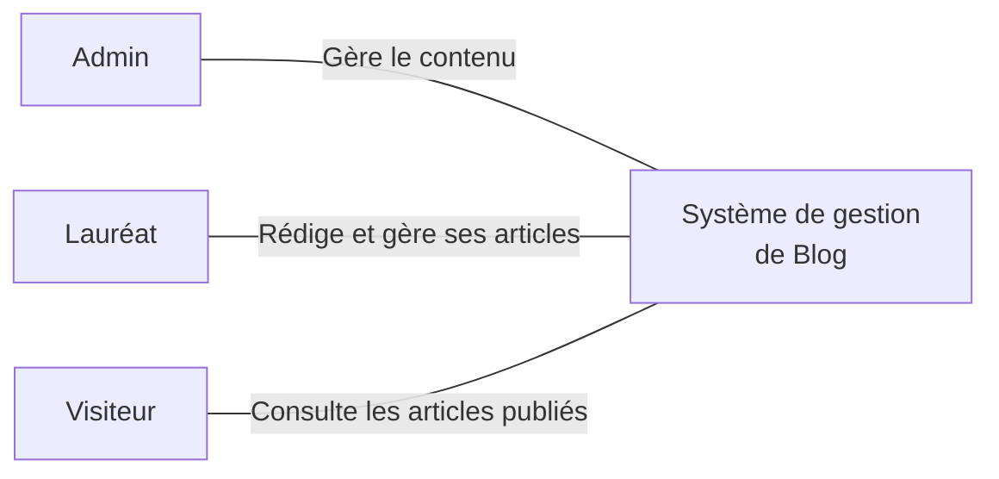

 

# Product Backlog

## Préparer le blog des lauréats

**Présenté par** : Mesbahi Mohammed Yassir
**Encadré par** : ES-Sarraj Fouad

---

## Plan de la présentation

- Introduction
- Problématique
- Solution
- Définition
- Acteurs
- Livrables
- Empathy Map

---

## Introduction

Avant le développement du blog, il faut comprendre ses utilisateurs et organiser leurs besoins.

Le lab Product Backlog permet de préparer le projet avant le développement.

---

## Problématique

La méthodologie Scrum nécessite l'existence d'un Product Backlog avant le démarrage du premier Sprint. Cependant, au début du projet, nous ne disposons pas encore d'une vision suffisamment claire des besoins réels des utilisateurs, de leurs problèmes et des fonctionnalités nécessaires.

---

## Définition

Le Product Backlog est une liste ordonnée des besoins et fonctionnalités à réaliser pour un produit.

Il est construit à partir des besoins validés des utilisateurs et priorisé avant le Sprint Planning.

---

## Solution

- Identifier les acteurs et leurs interactions
- Comprendre besoins, attentes et difficultés via Design Thinking
- Transformer les besoins validés en User Stories priorisées

Méthode choisie : Design Thinking avant le premier Sprint Scrum

---

## Acteurs du blog

- Administrateur : gère le contenu et les utilisateurs
- Lauréat : rédige et gère ses articles
- Visiteur : consulte les articles publiés

[Ouvrir le diagramme de contexte](./diagramdecontext.mmd)

---

## Diagramme de contexte

```mermaid
flowchart LR
    Admin["Admin"]
    Auteur["Lauréat"]
    Visiteur["Visiteur"]
    Blog["Système de gestion<br/>de Blog"]
    Admin ---|"Gère le contenu"| Blog
    Auteur ---|"Rédige et gère ses articles"| Blog
    Visiteur ---|"Consulte les articles publiés"| Blog
```

---

## Livrable — Backlog initial

| Priorité | Besoin utilisateur |
|---|---|
| P1 | En tant que visiteur, consulter les articles publiés |
| P2 | En tant que lauréat, rédiger, modifier et publier des articles |

---

## Livrable — Backlog initial

| Priorité | Besoin utilisateur |
|---|---|
| P3 | En tant qu’administrateur, gérer les utilisateurs et modérer les articles |
| P4 | En tant que visiteur, rechercher des articles publiés |

**Priorités initiales à confirmer avec les utilisateurs lors de la phase d’empathie.**

---

## Prochaines étapes

- Phase d’empathie Design Thinking : guide d’entretien, interviews, Empathy Map
- Liste initiale des besoins utilisateurs
- Construction du Product Backlog priorisé

## Empathy Map – Blog des Lauréats

Cette Empathy Map est réalisée à partir de la synthèse des interviews effectuées auprès des utilisateurs potentiels le 13/11/2026.

### 1. Que pense-t-il et ressent-il ?
- Il souhaite une interface simple et minimaliste.
- Il recherche une expérience de navigation agréable.
- Il veut accéder facilement aux informations.
- Il apprécie les articles courts, clairs et bien présentés.
- Il souhaite découvrir des contenus intéressants.

### 2. Que voit-il ?
- Des articles accompagnés d'images.
- Des descriptions courtes.
- Des catégories et différents niveaux.
- Des profils personnels et des profils de lauréats.
- Une barre de navigation organisée.
- Des options de filtrage et de recommandation.

### 3. Que dit-il et fait-il ?
- Il demande une interface minimaliste.
- Il propose d'organiser les articles par catégories et niveaux.
- Il souhaite filtrer les articles selon les vues et l'âge.
- Il demande des recommandations d'articles.
- Il souhaite consulter l'historique.
- Il propose d'ajouter une section de commentaires.
- Il souhaite un mode sombre.

### 4. Quels sont ses problèmes ? (Pains)
- Difficulté à trouver rapidement les articles.
- Manque d'organisation du contenu.
- Présentation des articles peu claire.
- Descriptions trop longues.
- Difficulté à retrouver les anciennes publications.
- Navigation qui peut être compliquée.

### 5. Quels sont ses besoins et bénéfices attendus ? (Gains)
- Une interface simple et moderne.
- Une navigation facile et bien organisée.
- Des articles illustrés avec des descriptions courtes.
- Des filtres pour faciliter la recherche.
- Des recommandations pertinentes.
- Un historique des articles.
- Un espace de commentaires.
- Un mode sombre.
- Une langue simple et accessible aux débutants.

### 6. Synthèse de l'Empathy Map

L'utilisateur recherche une plateforme de blog simple, moderne et intuitive, qui facilite la consultation, la recherche et l'organisation des articles. Il souhaite également profiter d'une expérience personnalisée grâce aux recommandations, aux filtres et aux fonctionnalités d'interaction.

**Source :** Synthèse des interviews réalisées le 13/11/2026.